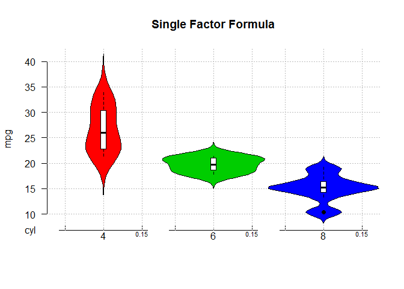
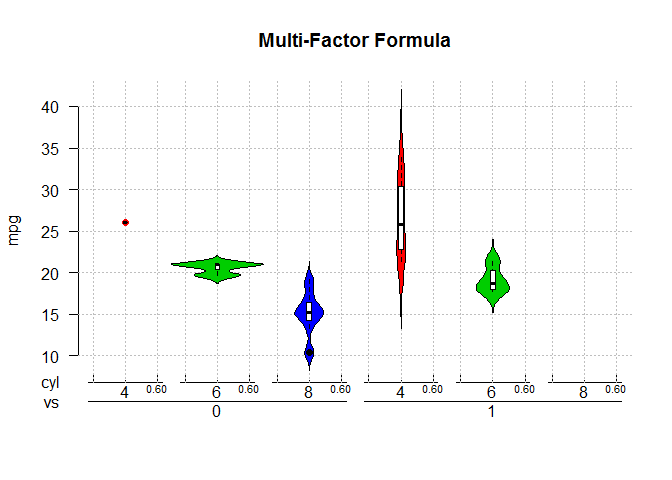

<!-- README.md is generated from README.Rmd. Please edit that file -->
violinplot
----------

Violin plot is a method for plotting numeric data using a rotated/mirrored kernel density plot. Other implementations exist (namely from [ggplot2](https://github.com/hadley/ggplot2)) that provide extensive customization. This package provides an alternative implementation that relies solely on base graphics, yet still provides methods for `data.frame`, `matrix`, `list`, `numeric` vectors, and `formula`.

There is another base-graphics implementation of violin plots, [here](https://cran.r-project.org/web/packages/vioplot/index.html), but it hasn't been updated since 2005 and its URL link is dead. It does not support all of the methods and functionality that this package supplies.

Installation
------------

It's not yet submitted to CRAN, so the only option currently is to import the development version from github:

``` r
devtools::install_github("r2evans/violinplot")
```

Sample Usage
------------

``` r
library(violinplot)
```

Anything (I think) that works for `boxplot` also works for `violinplot`:

``` r
violinplot(mtcars$mpg, main = "Single Vector")
violinplot(mtcars$mpg, mtcars$cyl, col = 2:4,
           main = "Two Vectors")
```

And, though `boxplot` already supports a "formula" method, the `violinplot.formula` method has been extended to provide spacing between the groups of factors:

``` r
violinplot(mpg ~ cyl, data = mtcars, col = 2:4,
           main = "Single Factor Formula")
```

<!-- -->

More complex formulas can be used as well:

``` r
violinplot(mpg ~ cyl + vs, data = mtcars, col = 2:4,
           main = "Multi-Factor Formula")
```

<!-- -->
